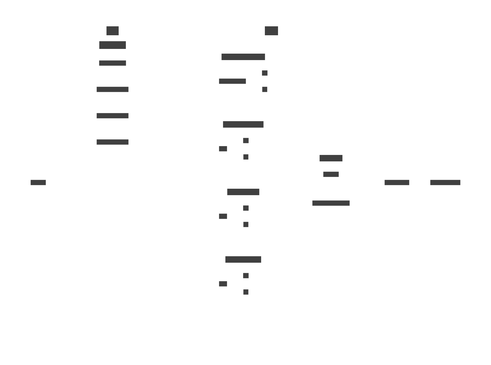

==============================================
eptri - SoC controller for the LUNA USB Device
==============================================

**General Description**

``eptri`` (end-point-tri) is a three-interface CSR controller that allows a CPU or Wishbone design to control the endpoints of a LUNA USB Device.

**Features**

* CONTROL peripheral for managing device connection, reset and connection speed.
* SETUP interface peripheral for reading control transactions from the host.
* OUT interface peripheral for reading data transfers from the host.
* IN interface peripheral for writing data transactions to the host.

Introduction
------------

Definitions
~~~~~~~~~~~

* *Controller* refers to the ``eptri`` controller as a whole, including all peripherals.
* *Peripheral* refers to ``USBDeviceController``, ``SetupFIFOInterface``, ``InFIFOInterface`` or ``OutFIFOInterface``.

Block Diagram
-------------

Signals
-------

Events
------

Registers
---------

The ``eptri`` controller provides four sets of registers corresponding to each peripheral.

``USBx`` - USBDeviceController
~~~~~~~~~~~~~~~~~~~~~~~~~~~~~~

.. list-table:: USBDeviceController Registers
  :header-rows: 1

  * - Offset
    - Size
    - Access
    - Name
    - Description
  * - 0x00
    - 32 (1)
    - rw
    - connect
    - Set this bit to '1' to allow the associated USB device to connect to a host.
  * - 0x04
    - 32 (2)
    - r
    - speed
    - Indicates the current speed of the USB device. 0 => High, 1 => Full, 2 => Low, and 3 => SuperSpeed (incl SuperSpeed+).
  * - 0x08
    - 32 (1)
    - rw
    - low_speed_only
    - Set this bit to '1' to force the device to operate at low speed.
  * - 0x0c
    - 32 (1)
    - rw
    - full_speed_only
    - Set this bit to '1' to force the device to operate at full speed.
  * - 0x10
    - 32 (1)
    - r
    - ev_status
    - usb event status register
  * - 0x14
    - 32 (1)
    - rw
    - ev_pending
    - usb event pending register
  * - 0x18
    - 32 (1)
    - rw
    - ev_enable
    - usb event enable register

``USBx_EP_CONTROL`` - SetupFIFOInterface
~~~~~~~~~~~~~~~~~~~~~~~~~~~~~~~~~~~~~~~~

TODO

``USBx_EP_IN`` - InFIFOInterface
~~~~~~~~~~~~~~~~~~~~~~~~~~~~~~~~

TODO

``USBx_EP_OUT`` - OutFIFOInterface
~~~~~~~~~~~~~~~~~~~~~~~~~~~~~~~~~~

Interrupts
----------

Each of the ``eptri`` peripherals can generate the following interrupts:

.. list-table:: USBDeviceController Registers
  :header-rows: 1

  * - Interrupt
    - Peripheral
    - Description
  * - USBx
    - USBDeviceController
    - Interrupt that triggers when the host issued a USB bus reset.
  * - USBx_EP_CONTROL
    - SetupFIFOInterface
    - Interrupt that triggers when the host wrote a new SETUP packet to the bus.
  * - USBx_EP_IN
    - InFIFOInterface
    - Interrupt that triggers after the peripheral has written a data packet to the bus and read back a PID ACK response from the host.
  * - USBx_EP_OUT
    - OutFIFOInterface
    - Interrupt that triggers when the peripheral has read a data packet from the host.

Programming Guide
-----------------

The programming guide provides sequence diagrams that detail the steps required to perform the various operations supported by the ``eptri`` controller.

The following pseudo-code is used through-out to indicate register operations:

.. list-table:: Register Operations
  :header-rows: 1

  * - Operation
    - Description
  * - ``r(PERIPHERAL.register)``
    - Read a value from the ``register`` belonging to ``PERIPHERAL``.
  * - ``w(PERIPHERAL.register, bits)``
    - Write ``bits`` to the ``register`` belonging to ``PERIPHERAL``.

OUT Transfers
~~~~~~~~~~~~~

IN Transfers
~~~~~~~~~~~~

TODO

CONTROL Transfers
~~~~~~~~~~~~~~~~~

TODO
