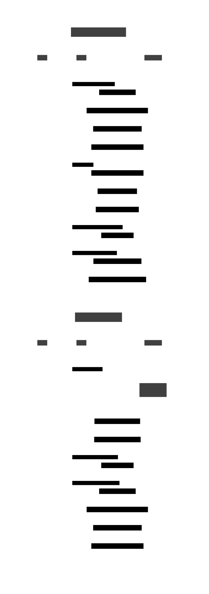
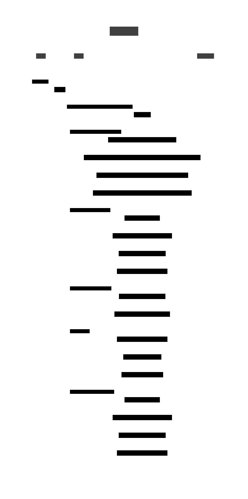
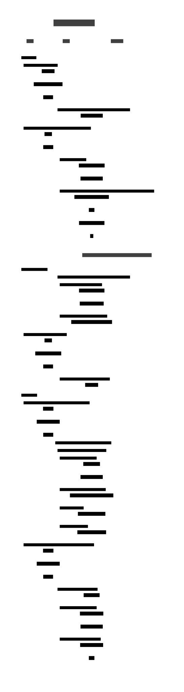
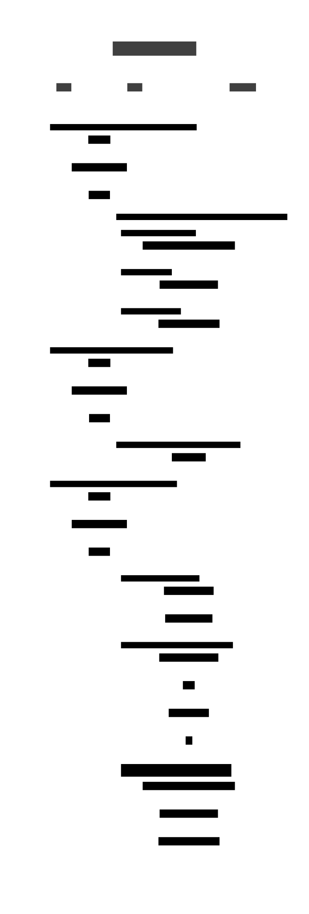

==============================================
eptri - SoC controller for the LUNA USB Device
==============================================

**General Description**

``eptri`` (endpoint-tri) is a three-interface CSR controller that allows a CPU or Wishbone design to control the endpoints of a LUNA USB Device.

**Features**

* CONTROL peripheral for managing device connection, reset and connection speed.
* SETUP interface peripheral for reading control transactions from the host.
* OUT interface peripheral for reading data transfers from the host.
* IN interface peripheral for writing data transactions to the host.

Introduction
------------

Definitions
~~~~~~~~~~~

* *Controller* refers to the ``eptri`` controller as a whole, including all peripherals.
* *Peripheral* refers to ``USBDeviceController``, ``SetupFIFOInterface``, ``InFIFOInterface`` or ``OutFIFOInterface``.

Block Diagram
-------------

.. literalinclude:: ../images/eptri/block-diagram.txt

Usage
-----

The exact details for integrating a LUNA eptri peripheral into a design will depend on the SoC platform you are using.

For example, using ``luna-soc``:

.. code-block:: python

    class Top(Elaboratable):
        def __init__(self):
            # instantiate the SoC
            self.soc = LunaSoC(
                cpu=VexRiscv(reset_addr=0x00000000, variant="cynthion"),
                clock_frequency=int(60e6),
            )

            # instantiate the eptri device controller peripheral
            self.usb0 = USBDeviceController()

            # instantiate the three endpoint interface peripherals
            self.usb0_ep_control = SetupFIFOInterface()
            self.usb0_ep_in = InFIFOInterface()
            self.usb0_ep_out = OutFIFOInterface()

            # add the peripherals to the SoC
            self.soc.add_peripheral(self.usb0)
            self.soc.add_peripheral(self.usb0_ep_control, as_submodule=False)
            self.soc.add_peripheral(self.usb0_ep_in, as_submodule=False)
            self.soc.add_peripheral(self.usb0_ep_out, as_submodule=False)

    def elaborate(self, platform):
        m = Module()

        m.submodules.soc = self.soc

        # instantiate a LUNA USB device
        usb0_bus = platform.request(platform.default_usb_connection)
        usb0_device = USBDevice(bus=usb0_bus)

        # add the eptri endpoint interface peripherals to the LUNA USB device
        # as endpoint handlers
        usb0_device.add_endpoint(self.usb0_ep_control)
        usb0_device.add_endpoint(self.usb0_ep_in)
        usb0_device.add_endpoint(self.usb0_ep_out)

        # connect the eptri device controller to the LUNA USB device
        m.d.comb += self.usb0.attach(usb0_device)

        m.submodules.usb0_device = usb0_device

        return m

Registers
---------

The ``eptri`` controller provides four sets of registers corresponding to each peripheral.

``USBx`` - USBDeviceController
~~~~~~~~~~~~~~~~~~~~~~~~~~~~~~

.. include:: ../images/eptri/registers-USB0.rst

``USBx_EP_CONTROL`` - SetupFIFOInterface
~~~~~~~~~~~~~~~~~~~~~~~~~~~~~~~~~~~~~~~~

.. include:: ../images/eptri/registers-USB0_EP_CONTROL.rst

``USBx_EP_IN`` - InFIFOInterface
~~~~~~~~~~~~~~~~~~~~~~~~~~~~~~~~

.. include:: ../images/eptri/registers-USB0_EP_IN.rst

``USBx_EP_OUT`` - OutFIFOInterface
~~~~~~~~~~~~~~~~~~~~~~~~~~~~~~~~~~

.. include:: ../images/eptri/registers-USB0_EP_OUT.rst

Interrupts
----------

Each of the ``eptri`` peripherals can generate the following interrupts:

.. list-table:: USBDeviceController Registers
  :header-rows: 1

  * - Interrupt
    - Peripheral
    - Description
  * - USBx
    - USBDeviceController
    - Interrupt that triggers when the host issued a USB bus reset.
  * - USBx_EP_CONTROL
    - SetupFIFOInterface
    - Interrupt that triggers when the host wrote a new SETUP packet to the bus.
  * - USBx_EP_IN
    - InFIFOInterface
    - Interrupt that triggers after the peripheral has written a data packet to the bus and read back a PID ACK response from the host.
  * - USBx_EP_OUT
    - OutFIFOInterface
    - Interrupt that triggers when the peripheral has read a data packet from the host.

Programming Guide
-----------------

The programming guide provides sequence diagrams that detail the steps required to perform the various operations supported by the ``eptri`` controller.

The following pseudo-code is used through-out to indicate register operations:

.. list-table:: Register Operations
  :header-rows: 1

  * - Operation
    - Description
  * - ``r(PERIPHERAL.register)``
    - Read a value from the ``register`` belonging to ``PERIPHERAL``.
  * - ``w(PERIPHERAL.register, bits)``
    - Write ``bits`` to the ``register`` belonging to ``PERIPHERAL``.

Device Connection
~~~~~~~~~~~~~~~~~~

Bus Reset
~~~~~~~~~

Control OUT Transfers
~~~~~~~~~~~~~~~~~~~~~

Control IN Transfers
~~~~~~~~~~~~~~~~~~~~

Bulk OUT Transfers
~~~~~~~~~~~~~~~~~~

Bulk IN Transfers
~~~~~~~~~~~~~~~~~

